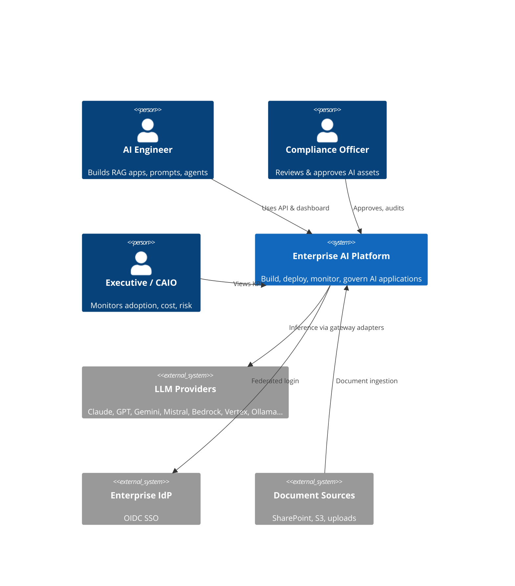
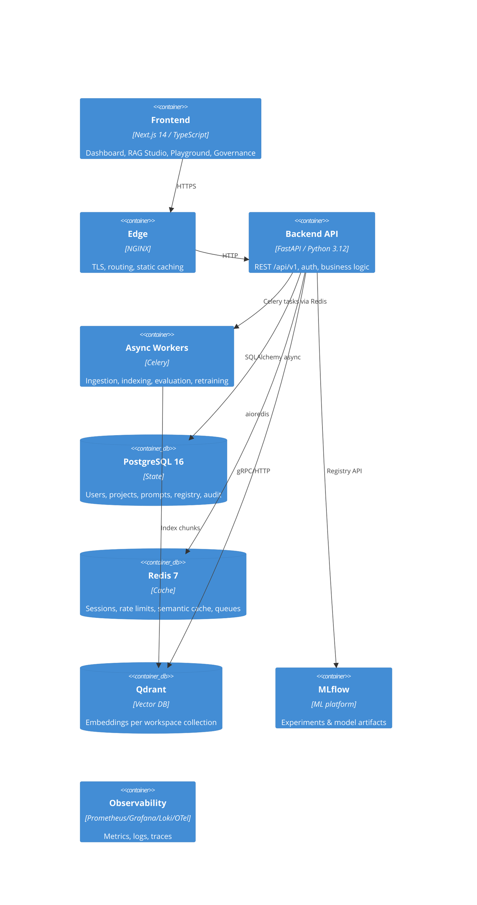
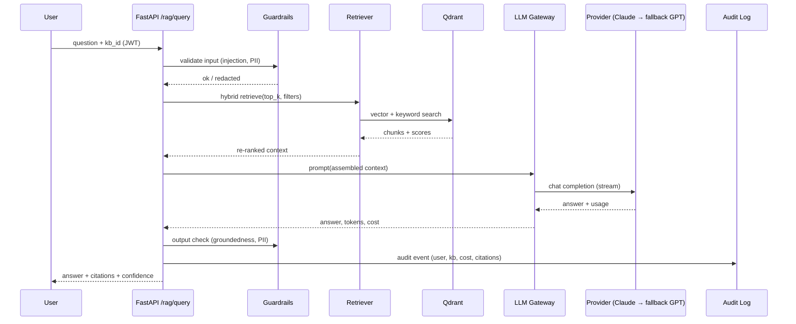

# Technical Architecture — Enterprise AI Platform

**Version:** 1.0 · **Date:** 2026-07-16

## 1. System overview

EAP is a modular monolith backend (FastAPI) with async workers (Celery), a Next.js frontend, and a
hexagonal core that keeps business rules independent from every framework and AI vendor. It is
deployed as containers behind NGINX, with PostgreSQL (state), Redis (cache/queues/rate limits),
Qdrant (vectors), MLflow (ML registry) and a Prometheus/Grafana/Loki/OpenTelemetry observability
stack.

A modular monolith (not microservices) was chosen deliberately for v1: one deployable unit with
strict internal module boundaries gives enterprise-grade maintainability without the operational
cost of a service mesh. Boundaries are already aligned so that `llm_gateway`, `rag`, and `agents`
can be extracted into services later without touching the domain layer (see ADR-001).

## 2. C4 — Level 1: System context



## 3. C4 — Level 2: Containers



## 4. C4 — Level 3: Backend components (hexagonal)

```
backend/app/
├── api/                    # PRESENTATION — routers, request/response schemas, deps
│   └── v1/  (auth, users, orgs, workspaces, projects, gateway, prompts,
│             knowledge_bases, documents, rag, conversations, agents,
│             models, experiments, deployments, governance, audit, monitoring, admin)
├── application/            # APPLICATION — use-case services, orchestration, transactions
├── domain/                 # DOMAIN — entities, value objects, business rules, ports (interfaces)
│   ├── entities/           #   pure dataclasses/pydantic — no framework imports
│   ├── ports/              #   LLMProviderPort, VectorStorePort, RepositoryPort, …
│   └── services/           #   pure business logic (routing policy, risk scoring, …)
├── infrastructure/         # INFRASTRUCTURE — adapters implementing ports
│   ├── database/           #   SQLAlchemy models, repositories, migrations, seed
│   ├── llm/                #   provider adapters (anthropic, openai, gemini, …)
│   ├── vector/             #   qdrant adapter (+ in-memory for tests)
│   ├── cache/              #   redis cache, rate limiter
│   ├── ingestion/          #   parsers (pdf, docx, pptx, xlsx, html, ocr…), chunkers
│   └── observability/      #   logging, metrics, tracing
├── ai/                     # AI LAYER — gateway, rag engine, agents, guardrails, evaluation
└── core/                   # SHARED — settings, security, exceptions, logging setup
```

**Dependency rule:** `api → application → domain ← infrastructure/ai`. The domain imports nothing
from FastAPI, SQLAlchemy, Redis or any LLM SDK.

## 5. Key sequence — RAG query with governance



## 6. Data flow — document ingestion

Upload → virus/size/type validation → object storage (`data/uploads`) → Celery task:
parse (format-specific parser, OCR fallback) → clean → chunk (strategy from KB config) →
embed (batch, provider adapter) → upsert to Qdrant (payload: doc id, version, page, metadata) →
mark document `indexed` → emit metrics + audit event. Re-ingestion bumps `version`; stale
vectors for old versions are deleted after successful reindex ("knowledge refresh").

## 7. AI architecture

- **LLM Gateway** (`ai/gateway`): single `ChatRequest → ChatResponse` contract. A routing policy
  (domain service) picks provider/model from: explicit request → project default → platform
  default. Failures cascade through the fallback chain with exponential backoff. Every call emits
  usage records (tokens, USD, latency) and Prometheus metrics; responses are cached (exact-match +
  optional semantic) in Redis.
- **Provider adapters** implement `LLMProviderPort` (chat, stream, embed where supported); pricing
  tables are configuration, not code.
- **Guardrails** run as pre/post pipelines: prompt-injection heuristics, PII regex+NER redaction,
  toxicity filter, JSON-schema output validation, groundedness check (citation overlap + LLM judge).
- **Agents** (`ai/agents`): declarative `AgentSpec` (role, system prompt ref, tools, memory,
  budget). Orchestrator executes plan → act → reflect with hard guards (max iterations, max cost).
  Tools are typed, validated, and every execution is logged.
- **Evaluation** (`evaluation/`): dataset-driven suites for prompts (assertions + LLM judge), RAG
  (faithfulness, relevance, context precision/recall) and agents (task/tool success), runnable in
  CI and persisted for trend dashboards.

## 8. Security architecture

TLS at NGINX → JWT (HS256, short-lived access + rotating refresh) → RBAC dependency on every
route (scope = platform/org/workspace/project) → Pydantic validation on all inputs → rate limiting
(Redis sliding window, request- and token-based) → secrets only via environment/secret manager →
structured logs with secret/PII redaction → immutable audit table (append-only, hash-chained) →
OWASP Top 10 review in CI (bandit, dependency audit).

## 9. Deployment architecture

- **Docker Compose** — full stack for evaluation/dev (single host).
- **Kubernetes** — production: Deployments (api ×3, worker ×2, frontend ×2), StatefulSets
  (postgres, qdrant), HPA on api/worker, PodDisruptionBudgets, NetworkPolicies, Ingress-NGINX,
  secrets via `Secret`/external-secrets, probes wired to `/health/live` and `/health/ready`.
- **Terraform** — modules for network, managed Postgres, Kubernetes cluster, container registry,
  DNS; cloud-agnostic layout with AWS reference implementation.

## 10. Technology choices & trade-offs (summary)

| Choice | Why | Trade-off accepted |
|---|---|---|
| Modular monolith | Fast delivery, simple ops, clear seams | Requires discipline on module boundaries (enforced by import rules) |
| FastAPI + Pydantic v2 | Async, typed, OpenAPI for free | — |
| PostgreSQL | ACID, JSONB for flexible metadata, ubiquitous | — |
| Qdrant | Fast HNSW, payload filtering, hybrid support, self-hosted | Second datastore to operate (behind `VectorStorePort`, swappable to pgvector) |
| Redis | Cache + rate limit + Celery broker in one | Single point — mitigated by K8s HA setup |
| Celery | Mature, observable async jobs | Heavier than arq/BackgroundTasks; justified by ingestion volume |
| MLflow | De-facto standard registry/tracking | Separate UI; integrated via API + links |
| Next.js 14 App Router | SSR dashboard, TS end-to-end | — |

Decisions are individually recorded in [ADRs](adr/).
